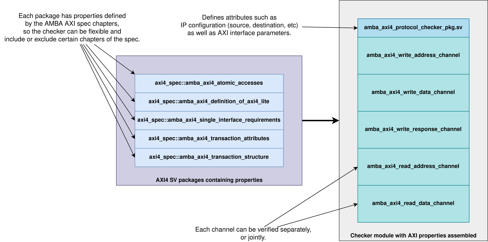
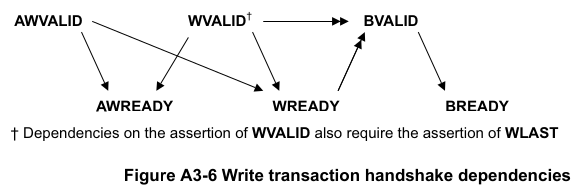
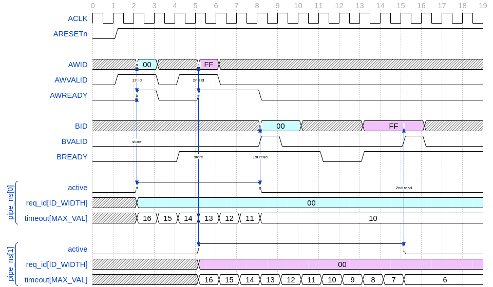
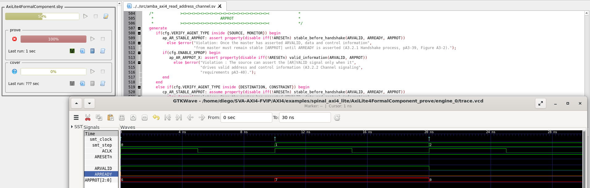
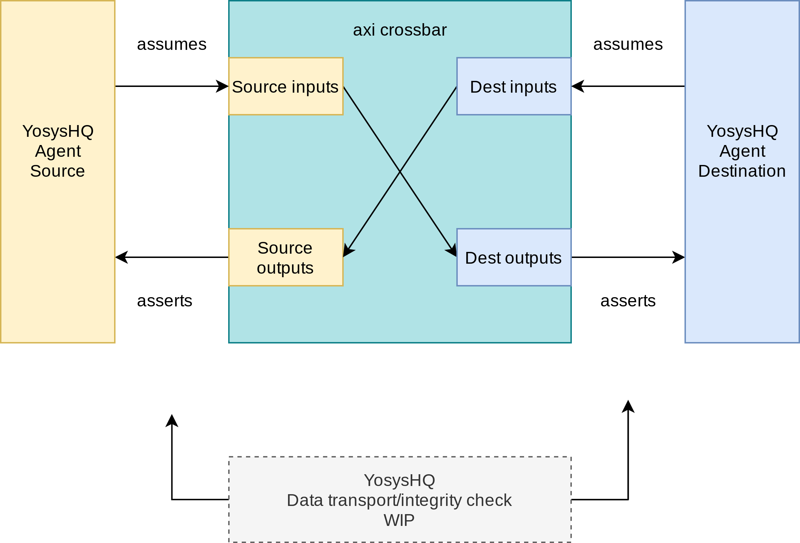
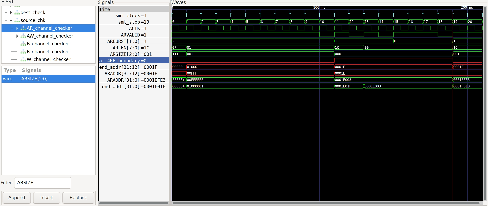
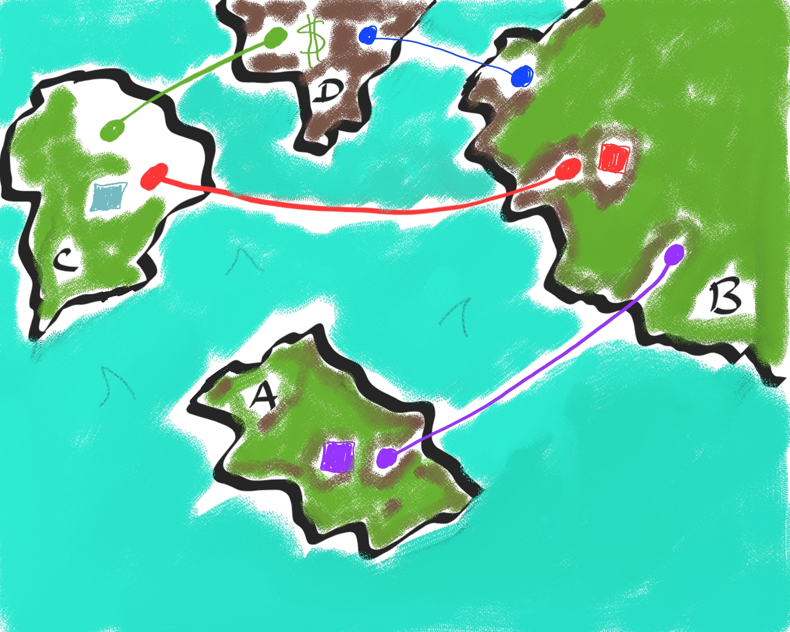

===============================================
YosysHQ SVA AXI Verification IP
===============================================

========
Abstract
========
AXI4 is a well known bus protocol used extensively for FPGA and ASIC designs. At YosysHQ, we have developed an open source verification IP (VIP) to demonstrate the usefulness of such verification IP and as a showcase of how to develop formal verification IP.

This AppNote will cover the following topics:

* A quick glance at the new `SVA-AXI4-FVIP <https://github.com/YosysHQ-GmbH/SVA-AXI4-FVIP>`_.
* Parameters and configuration descriptions.
* A usage example in an interconnect design.

Note that as these properties are written in SVA, they are not compatible with the OSS CAD suite. Please contact YosysHQ for an evaluation of the `Tabby CAD suite <https://www.yosyshq.com/tabby-cad-datasheet>`_.

============
Introduction
============
Formal verification offers a way to prove exhaustively that your design is correct. It doesn’t rely on simulation, instead using solvers to prove assertions about your design.

Verification IP offers the possibility to use 3rd party assertions rather than writing your own.

YosysHQ is primarily an EDA tools company, but we wanted to make a VIP that would demonstrate our tools in a practical context that resembles the tasks a verification engineer would work on. In addition, we wanted to provide some guidance on how to write your own VIPs.

We prioritized:

* Good organization of the code.
* Debuggability capabilities.
* Documentation and methodologies for quick start.
* Developed using properties optimized for model checking.
* Open source to improve auditability and learning opportunities.

============================
AXI4 Formal VIP Architecture
============================

--------
Features
--------
For detailed information regarding modes, properties descriptions and methodologies please check the file `UG_verification_plan.pdf <https://github.com/YosysHQ-GmbH/SVA-AXI4-FVIP/raw/main/AXI4/doc/UG_verification_plan.pdf>`_.

.. warning::
  The SVA AXI4 FVIP follows the Assume-Guarantee paradigm. This means that all results obtained from the formal verification tool are *guaranteed* *assuming* the driving (or neighbour) module drives protocol-compliant signals as well. So it is recommended to verify both the driver and the receiver for completeness.

The features and limitations of the new AXI4 SVA FVIP are as follows:

* Support for different usage models:

  * To verify a manager.

  * To verify a subordinate.

  * To act as a protocol-compliant constraints provider.

  * To act as a monitor on a bus where a manager and a subordinate communicate.

* Support for AXI4-Lite and AXI4-full.

* Limited to a single transaction ID.

  * In-order transactions.

  * No interleaving.

* No transaction caching, buffering or modifications.

  * Same bus width on all interfaces.

* Written using simple SystemVerilog constructs for portability.

* ARM recommended checks:

  * Low power channel interface.

  * X-propagation interface.

  * Deadlock checks.

* A comprehensible documentation.

  * User guide.

  * Methodology guide.

  * Examples.

  * Instantiation templates.

.. note::
  Full AXI4 implementation is possible. There exist formal VIPs to test more than one transaction at a time, out-of-order transactions, full exclusive transaction monitors, data interleaving, etc. This Formal Verification IP only covers some of the most commonly used features of the AXI4 protocol. If additional features are required, we hope that this open source FVIP can inspire a motivated reader to extend it to accommodate their needs.

------------
Architecture
------------
We designed the AXI4 SVA FVIP having in mind the fundamental architectural descriptions in the AMBA AXI4 IHI0022E spec (A1.3 AXI Architecture):

* Each channel (W, AW, B, AR, R) is defined in its own module, and each module contains only the properties that are necessary for that AXI4 channel.

  * This way, each verification engineer can focus on a certain channel without having to load checks that are not of interest for the test in question.

  * Also, design engineers can incrementally add features or changes to an IP and get immediate feedback on the correctness of the implementation, without adding information that might not be required.

* The properties are organized using SystemVerilog packages, and each package contains only the properties mentioned in the corresponding chapter of the spec.

  * This helps to disable checks that are not required, already proven, etc, as well as isolating properties for further investigation. And of course, to have a better understanding of what is required to implement the interfaces correctly.

  * We also include the ``amba_axi4_protocol_checker.sv`` which is a general *out-of-the-box protocol checker* with all channels instantiated and all properties enabled.

* There is a separation between AMBA AXI rules and FVIP implementation libraries.

  * All explicit references in AMBA AXI4 IHI0022E are under the ``axi4_spec`` directory.

  * All of the libraries and implementations that are not explicitly stated in the spec, are under the ``axi4_lib`` directory.

* A number of configuration knobs so the FVIP can be as flexible as possible.

  * One advantage of not having an encrypted IP is that the properties can be extended for cases like IPs that do not strictly follows the AMBA spec in some aspects, which is common in the industry.

* As easy as possible debugging.

  * Each property has messages that point to the reference in the AMBA AXI4 IHI0022E, so upon failure, the user can just open the document, look up the page number and compare the design behavior to what is defined in the spec.

  * Some `let binders` are helpful to root-cause issues when calculations or temporal transactions are used. When they are deasserted, the user can follow the definition of the `let binder` and easily find the time where that requirement failed, and why.

  * Properties receive the signals of interest as arguments, so it is easy to add them in the waveform (for tools that automatically open the debugger with COI signals, you will have everything you need immediately).

* And last but not least, the implemented checks are compliant with ARM AMBA AXI4 IHI0022E.

  * That means, we strictly followed the descriptions in the spec.

  * We developed an infrastructure to verify our implementation based on information that is publicly available on the ARM website.

.. note::
  This Verification IP was developed independently with no help from ARM, thus misinterpretations of the standard may have snuck in. We have not seen any divergence between results of public ARM verification IP and ours, but `we will be glad to know about any discrepancies you may discover <https://github.com/YosysHQ-GmbH/SVA-AXI4-FVIP/issues>`_.

:numref:`Figure %s <org>` shows the architecture of the AXI4 SVA FVIP. For more information refer to the `UG_verification_plan, Section III.6: Architecture <https://github.com/YosysHQ-GmbH/SVA-AXI4-FVIP/raw/main/AXI4/doc/UG_verification_plan.pdf>`_.

.. _org:

  Architecture and file organisation.

As an example of what is described above, this is the `valid_before_handshake` property defined inside *amba_axi4_single_interface_requirements.v* package, which is derived from section A3 of the AMBA AXI4 spec. All properties described in that section are defined in the same package.

.. code-block:: systemverilog

  /* ,         ,                                                     *
   * |\\\\ ////| "Once VALID is asserted it must remain asserted     *
   * | \\\V/// |  until the handshake occurs, at a rising clock edge *
   * |  |~~~|  |  at which VALID and READY are both asserted".       *
   * |  |===|  |  Ref: A3.2.1 Handshake process, pA3-39.             *
   * |  |A  |  |                                                     *
   * |  | X |  |                                                     *
   *  \ |  I| /                                                      *
   *   \|===|/                                                       *
   *    '---'                                                        */
   property valid_before_handshake(valid, ready);
    valid && !ready |-> ##1 valid;
   endproperty // valid_before_handshake

Then, in each channel that needs to honor this property, it is assembled as shown below:

.. code-block:: systemverilog

  if(cfg.VERIFY_AGENT_TYPE inside {SOURCE, MONITOR}) begin
     ap_W_AWVALID_until_AWREADY: assert property(disable iff(!ARESETn) valid_before_handshake(WVALID, WREADY))
       else $error("Violation: Once WVALID is asserted it must remain asserted until the handshake",
             "occurs (A3.2.1 Handshake process, pA3-39).");
    end
    else if(cfg.VERIFY_AGENT_TYPE inside {DESTINATION, CONSTRAINT}) begin
     cp_W_AWVALID_until_AWREADY: assume property(disable iff(!ARESETn) valid_before_handshake(WVALID, WREADY))
       else $error("Violation: Once WVALID is asserted it must remain asserted until the handshake",
             "occurs (A3.2.1 Handshake process, pA3-39).");
    end

The user can drag and drop the signals to the waveform, only the ones stated in the property, and look at the message and/or the package where this property is defined to start debugging. Sometimes, the message in the assertion is clear enough that there might be no need to look up the spec - but never trust code, it is recommended to confirm with the relevant reference.

===================================================
Formalisation and Optimisation of the AXI4 SVA FVIP
===================================================

------------------------------
When to use BMC or K-induction
------------------------------
All of the properties defined in the IHI0022E spec are invariants, that is, they must hold *invariably* of the design input values and/or initial states. A good rule of thumb is to use *BMC* for the AXI control signals, such as handshakes, strobes, etc, and start with BMC but move incrementally to K-induction for data transport checks, such as properties for *channel relationships* or whenever tracking of "in-flight" data is needed. (Although BMC with sufficient radius can be enough to gain confidence.)

Bounded Model Checking (BMC) with AXI SVA FVIP
----------------------------------------------
Regarding the calculation of the radius, or the *depth* for the BMC and K-induction, it depends on some factors:

* The ARM recommended properties for deadlock imposes a min radius of 16 plus extra cycles to let the solver explore more state space. If these properties are disabled, the second more complex property is the *channel relationships*. And of course, if the delay between the *ready* and *valid* signal is changed from 16, the bound should be fixed accordingly.

* For the *channel relationships* and taking into account the features of this FVIP, the write transaction must complete before issuing another one, so the *depth should be sufficient to allocate enough time for this completion w.r.t the DUT*, plus some extra cycles to explore.

* Therefore, the *default settings of SBY should be enough in most cases*, unless modifications to the already mentioned parameters are applied, to which the recommendations already described should be followed.

Our FVIP contains many cover properties to help decide if the depth is good enough (covers reached) or if it should be increased (unreachable covers).

K-induction with AXI SVA FVIP
-----------------------------
Everyone knows the equation of mathematical induction, but sadly not everyone seems to get what it really means for formal verification. To back up what I will write in this section, and hoping it helps to clear the doubts, look at the example drawing that I did in 10 minutes (sorry, I'm not an artist) which is located in the **Appendix A** if this document.

The real difficulties are to come with an inductive invariant. Remember that k-induction frees up the initial state, so a well defined, strong and complete set of assertions and correct initial values in registers are needed to make k-induction proofs happy. And the depth, as discussed in **Appendix A**, can be as low as the employed inductive invariants permits. For the SVA AXI FVIP, the properties should not cause *undetermined* results in induction as long as the DUT is configured as expected (for example, that all the registers are correctly initialised). For advanced flows, the user can abstract this initial state and get the most of k-induction (as an example, in an interconnect verification, the user can abstract the initial state so the subordinates have many valid transactions pending, and check how the manager reacts from the first clock cycle).

As with BMC the default configuration of SBY may be enough for most of the cases, and modifications would be needed only if different parameters or complexity in designs changes.

------------------
Boolean Properties
------------------
Most properties in the AXI SVA FVIP are described using Boolean operators, so all bit-level solvers are happy with them. We were tempted to explore some of the less well known features of the SMT solvers in Tabby CAD Suite, but as this would render the properties incompatible with other tools, we decided to keep them as simple as possible.

------------------------
Data Tracking Invariants
------------------------
Control properties are easy to describe in the AXI4 protocol, what is more tricky is to formalise the properties where data tracking is required, for example, atomic transactions and dependencies between channels. We will use the latter as an example for this section.

The AMBA AXI4 IHI0022E depicts the channel dependencies with the following data flow diagram:

.. _interdep:

What this means in short is, for a subordinate to show a *valid response*, the following events must have happened:

* A valid address write, signaled by the completion of the AW channel (``AWVALID & AWREADY`` handshake).

  * Here, we store the ``AWID``, the tag of such transaction.

* Of course, the data of such address request must have completed as well (completion signaled by the handshake of ``WVALID & WREADY``).

  * A very important information here is that ``WLAST`` should occur first before asserting ``WVALID``, so when we have a handshake in the W channel, we store the ``WLAST`` value as well.

* Finally, we monitor for the assertion of ``BVALID``, to check the following properties (they are split for convergence/performance reasons).

  * The value at ``BID`` must match one of the stored values of ``AWID`` (in the case of OOO transactions) or the value stored in the head of the data structure (in case of in-order transactions). Otherwise the response is invalid.

  * The value of ``WLAST`` stored during the W transaction must be HIGH, otherwise the response is invalid.

This is how we cover the dependencies between AW, W and B channels, as the rest of scenarios where different order of handshakes can occur needs to fulfil this rule anyway (these scenarios can be observed with a cover property, but it is a mere preference of the visualization information this brings to the user, so we decided not to add them).

To track data, many AXI simulation IP uses CAM-based tables, which is an obvious solution, but since it search in the entire table for the stored ID, this becomes a burden for formal verification (the more IDs, the more states the CAM adds to the model). Our solution is to use a non-deterministic transaction-counter structure which has the following features:

* Implicit forward-progress counters: one can see how many transactions are pushed into the pipeline, how many are read, or if there is no transactions at all.

* Deadlock checking: each transaction is marked with a timestamp (in clock cycles) to put a constraint on the life of such transactions. If the transfer is not processed and reaches timeout, the scoreboard signals an error for further investigation (either deadlock or performance issue).

* Of course, data integrity check for the stored IDs.

The disadvantage of this approach is that the user should know beforehand the max number of transactions the IP can handle. We recommend to start tracking a low number of transactions and incrementally increase the number.

:numref:`Figure %s <scoreboard>` shows how the scoreboard works. As soon as AW handshake occurs, the value seen at AWID is stored. In this example, we store two AWIDs with values ``'h00`` and ``'hFF``. Once a pipeline packet has stored a transfer, we mark it as an active. When BVALID is asserted, the value presented at BID must match the value stored at the head of the pipeline data structure. If this is the case, the behavior is proven, otherwise a CEX is shown. Once a packet has been read, we mark it as invalid.

.. _scoreboard:

  Scoreboard

.. note::
  * The counters at *timeout* can be used to get an idea of the performance of the DUT. The timeout checks can be disabled.
  * There is an overflow check that is asserted when more write requests than pipeline packets exist. This can be disabled as well.
  * By looking at how many packets become active/inactive, we can see that we actually make progress during transaction verification, and that no check is vacuous.

=======================
Using the SVA AXI4 FVIP
=======================
The SVA AXI4 FVIP comes with some basic examples, we describe them in this section.

--------------
Synthesis Test
--------------
The most basic and fundamental way to test a formal verification IP is by the tautology method, that is, connecting the assertions to their versions as assumptions. If everything is configured correctly, all checks should pass within seconds. If there is some misconfiguration, or something that exists as a check but not as a constraint, or vice versa, the tool will show a CEX.

This test is much more useful when comparing between different implementations, for example, comparing FVIP from vendor *A* to the FVIP from vendor *B*.

Whenever the user adds new properties or modifications, it is recommended to run this test before running the test directly on the DUT.

------------------
AMBA Validity Test
------------------
This test uses the AMBA certified SVA IP (intended for simulation) as reference to check the validity and satisfiability of the YosysHQ AXI4 SVA FVIP. This test is just a bounded model between formal IP assumptions and formal IP assertions, using the AMBA SVA IP as a monitor agent. The results are interpreted as follows:

* Any assertion that passes in the AXI4 SVA FVIP but not in the AMBA IP, may probably be a failure.

* Any assertion that fails in the AMBA IP, is either a failure or a missing behavior.

You can check the `Results.xlsx` sheet that contains the latest results from this test.

-----------------------------
SpinalHDL AXI4-Lite Component
-----------------------------
For this example, we use `SpinalHDL <https://github.com/SpinalHDL/SpinalHDL>`_ to write a very simple AXI4-Lite component. We are not interested in the datapath but in the control,  therefore the actual function that the scala source describes is not relevant. Here is an excerpt of such component.

.. code-block:: scala

  class AxiLite4FormalComponent extends Component {
    val io = new Bundle {
    val bus = slave (AxiLite4 (AxiLite4Config (addressWidth = 32, dataWidth = 32)))
    val o_result = out UInt (32 bits)
  }

    val ctrl = new AxiLite4SlaveFactory (io.bus)
    var AxiFunction = new LogicFunction ()
    ctrl.driveAndRead (AxiFunction.io.port_a, address = 0)
    ctrl.driveAndRead (AxiFunction.io.port_b, address = 4)
    ctrl.read (AxiFunction.io.port_r, address = 8)

    io.o_result := AxiFunction.io.port_r
  }

There are some protocol violations in this design. For example, the property ``ap_AR_STABLE_ARPROT`` is violated, as ``ARPROT`` can change its value when it has not been acknowledged (red shows the violation).

.. _spinal_arprot:

  GUI View

(The SBY gui can be launched by executing the command ``sby-gui`` in the directory where the ``.sby`` file resides, in this case in ``AXI4/examples/spinal_axi4_lite/``.)

-------------
AXI4 Crossbar
-------------
We also provide an example of how to use the FVIP to test different configurations for crossbars/interconnects. In more complex designs where different topologies are involved, or even where different types of bridges and adaptors are required, but testing the entire system becomes very complex, the FVIP can be used to replace the upstream/downstream components to focus on one task at a time.  :numref:`Figure %s <arch_xbar>` shows a diagram of how the FVIP is connected to the crossbar.

.. _arch_xbar:

  Connecting an AXI Crossbar

There is a document that covers the setup and some results of this example in `AXI4/examples/axi_crossbar/doc/crossbar_example.pdf <https://github.com/YosysHQ-GmbH/SVA-AXI4-FVIP/raw/main/AXI4/examples/axi_crossbar/doc/crossbar_example.pdf>`_. One of the properties that failed is *Read burst crossing 4K address boundary*. The AXI4 Formal IP found a violation in the crossbar around time step 19, ``ARBURST = INCR``, ``ARLEN = 1Ch``, ``ARSIZE = 1h`` and ``ARADDR = 1EFE3h`` giving a final address of ``1F01Bh``, crossing the 4K boundary.

.. _ar_bound_4k:

  Example violation: crossing a 4k boundary

.. note::
  The failing property was obtained in the inductive test and may not be valid, but it has a purpose. One usually can find interesting scenarios by weakening the inductive property (not adding all required constrains but with some guidance), because SBY cannot generate certificates of witness yet, so this can help to investigate the design further. This is not a recommendation, and many times it does not serve a purpose without having previous knowledge of certain weak structures of the design.

============================
Completeness of the Protocol
============================

-------------------------------------------------------------
Appendix A. Simple and Oversimplified K-Induction Explanation
-------------------------------------------------------------

We want to play a game in this map. The goal is to get the treasure (depicted as dollar symbol) which is located in island D. But there are some rules that must be followed:

* The game ends successfully when a player reaches **island D**.
* The player must have passed through **island B** before reaching **island D**.
* To travel from **island A** to **island B**, the player needs to find the *purple mysterious box*. We know for a fact that the box is located in this **island A**.
* The same rule applies for traveling from **island B** to **island C**, but the color of the box is *red* in this case.
* Exactly the same rule applies for the path between **island C** to **island D**, but the color of the box is turquoise.
* The player can take up to 3 months traveling between islands, because they are very far from each other.

.. _penup_20220416:

  A map to induction.

But there is another trick to help the player survive. Suppose the player can choose in which island to start, and in which condition they will be when starting in that island. The player in his ambition, decides to start immediately in **island B** and move through the blue bridge directly to the treasure. **They lose the game because they have no boxes to carry the treasure**.

The player gets a second chance, so they take a better look, and think that *if they visit island B correctly, it must be because they were in island A and got the purple box. And if they are in island C, <<assuming>> the first statement happened, and collect the turquoise box, then they can move to island D and get the treasure, and no rule is broken*. So they decide to start in island C assuming they have visited previously island A and B, and have both purple and red boxes. In the first turn, the player gets the turquoise box, then moves to island D and wins the game.

How does this relate to k-induction?

* K-induction is like BMC, but freeing the initial state. That means that the solver can start at any state from the timeline of the design. In this example, the solver is analogous to the player, and the *free initial state* is the ability to start at any island.

* Sometimes K-induction can return "weird" invalid results, because *the property has some holes*. Like in this example, the goal was reached when player was moving directly from island B to island D, but at the expense of not having fulfilled one requisite needed to win.

*  The purpose of K-induction is to find inductive invariants, by strengthening the problem at hand:

* The problem is to reach island D to get the treasure.

* For **the basecase**, we assert that if island_A and purple_box follows island B and if island_B and red_box follows island C. If they are proven to be correct in this step, then we check the inductive step.

* For the **inductive step**, we check that if island_C and turquoise box follows island_D and win. We *assume* the **basecase**, which lead us to only one path, which is the path we wanted to find. Then *we win*, because it does not matter from where the player starts, if the requisites are fulfilled, the player will end all the time reaching island D and wining. Also note that, since our property was strong enough, we rule out the initial path the player picked as starting point which led to losing the game (B to D using blue bridge).

* This took no more than **2** steps to prove. Which means that a well defined inductive invariant does not need that many steps to be proven.
